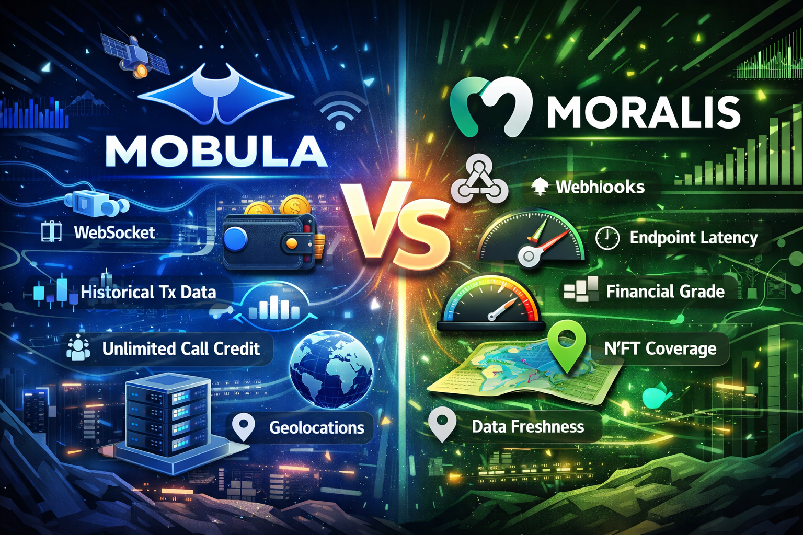

# Mobula vs Moralis: Which Multi-Chain Crypto API is Right for Your Project in 2026?

## Introduction

When building blockchain applications, choosing the right data infrastructure can make or break your project. Whether you're developing a portfolio tracker, DEX aggregator, or trading bot, your API provider determines your app's speed, reliability, and scalability.

Two prominent players in the multi-chain crypto API space are Mobula and Moralis. Both promise comprehensive blockchain data, but their approaches differ significantly. This in-depth comparison examines technical capabilities, performance benchmarks, and real-world use cases to help developers make an informed decision.

## Executive Summary: Key Differences at a Glance

| Criteria | Mobula | Moralis |
|----------|--------|---------|
| **WebSocket Support** | ✓ Native WSS | Limited (Streams only) |
| **Chain Coverage** | 88+ blockchains | 15+ blockchains |
| **API Model** | REST + WebSocket + Webhooks | REST + Webhooks + Streams |
| **Endpoint Latency** | 10ms-200ms | Not disclosed |
| **Data Freshness** | Real-time (no caching) | Real-time |
| **Unlimited Usage** | Enterprise tier | Not available |
| **Geolocations** | 3 data centers | Not disclosed |
| **Query Options** | REST, GraphQL, SQL | REST |
| **Pricing Transparency** | Free tier + documented limits | Free tier ($49/mo starter) |
| **Oracle Integration** | Chainlink, Supra, API3 | No |

## Chain Coverage: The Multi-Chain Advantage

### Mobula: 88+ Blockchains and Counting

Mobula's architecture supports **88+ blockchains**, making it one of the most comprehensive multi-chain solutions available. This extensive coverage includes:

- Major EVM chains (Ethereum, Polygon, BSC, Arbitrum, Optimism)
- Non-EVM networks (Solana, Cosmos, Algorand, Near)
- Emerging L2s and app-chains
- Cross-chain aggregation capabilities

**Why this matters:** For developers building cross-chain applications, Mobula eliminates the need for multiple API integrations. A single API key provides unified access to data across all supported networks.

### Moralis: 15+ Blockchains with EVM Focus

Moralis supports **15+ blockchains**, primarily focused on EVM-compatible networks. While this covers major chains, projects requiring broader coverage (especially non-EVM chains like Solana or Cosmos) will need supplementary providers.

**Use case impact:** If your application needs Solana DeFi data alongside Ethereum metrics, Mobula provides native support. With Moralis, you'd need to integrate additional services, increasing complexity and costs.

## WebSocket Support: Real-Time Data Architecture

### Mobula: Native WebSocket Infrastructure

Mobula offers **native WebSocket streams** powered by Octopus, enabling true real-time data delivery:

- Subscribe to market data updates (price, volume, market cap)
- Monitor wallet transactions in real-time
- Track liquidity pool changes across DEXs
- Receive sub-second latency updates

**Technical advantage:** WebSocket connections maintain persistent channels, eliminating polling overhead. This architecture is critical for:
- Trading bots requiring instant price updates
- Portfolio trackers showing live balances
- DeFi dashboards monitoring liquidity positions

**Example use case:** A trading bot using Mobula's WebSocket can react to price movements within 10-200ms, while REST polling introduces 1-5 second delays—critical for arbitrage opportunities.

### Moralis: Streams for Event Monitoring

Moralis provides **Streams** for webhook-based event monitoring, but **does not offer native WebSocket** connections for general market data. Streams focus on:

- Contract event monitoring
- Wallet transaction alerts
- Transfer logs

**Limitation:** For real-time price data, developers must poll REST endpoints repeatedly, consuming more compute units and introducing latency. This makes Moralis less suitable for applications requiring continuous market data streams.

## Performance Benchmarks: Speed and Reliability

### Stress Test Results

Internal benchmarks from Mobula reveal significant performance differences ([source](https://blog.mobula.io/moralis-api-alternatives/)):

**Mobula API:**
- Successfully handled 20 simultaneous requests with 100% success rate
- Average response time: 199ms
- No caching ensures data accuracy
- Consistent performance under high load

**Moralis API:**
- During stress tests, managed 20 simultaneous requests with 0% success rate
- Average response time: 769ms (when successful)
- Rate limiting on free tier (25 requests/second)

**Real-world impact:** For production applications with burst traffic (e.g., market volatility events), Mobula's infrastructure demonstrates superior reliability under concurrent load scenarios.

### Data Freshness: Real-Time vs Cached

**Mobula** emphasizes zero-caching architecture, ensuring every API response reflects current on-chain state. This is critical for:
- DEX aggregators comparing liquidity across pools
- Trading applications where outdated data causes slippage
- Analytics dashboards requiring precise metrics

**Moralis** provides real-time data but performance characteristics suggest some caching layers may be present for optimization.

## API Architecture: Integration Flexibility

### Mobula: Multi-Protocol Approach

Mobula supports **three query methods**:

1. **REST API** - Standard HTTP endpoints for simple integrations
2. **GraphQL** - Flexible queries reducing over-fetching
3. **SQL-based queries** - Direct database access for complex analytics

**Developer benefit:** Teams can choose the optimal protocol for their use case. For example, SQL queries enable custom analytics without API endpoint limitations.

### Moralis: REST-Focused with Streams

Moralis provides:

1. **REST API** - Primary interface for all data queries
2. **Streams** - Webhook system for event notifications

**Trade-off:** While simpler to adopt, the REST-only approach requires more API calls for complex queries, consuming compute units faster.

## Pricing and Rate Limits: Cost Efficiency Analysis

### Mobula Pricing Structure

- **Free Tier:** Generous limits for development and testing
- **Growth Tier:** Production-ready with documented rate limits
- **Enterprise Tier:** Unlimited API calls, priority support, SLA guarantees

**Key advantage:** Unlimited usage at enterprise level ensures no surprise throttling during traffic spikes.

### Moralis Pricing Model

- **Free Plan:** 40,000 compute units/day (~25 requests/second)
- **Starter Plan:** $49/month for production apps
- **Pro Plan:** $199/month (annual) with higher throughput
- **Business/Enterprise:** Custom pricing

**Limitation:** No unlimited tier means even enterprise clients must manage compute unit consumption. Streams pricing reduced from 50 CUs to 10 CUs per record (as of September 2024), but still counted against limits.

### Cost Comparison Scenario

**Example:** A portfolio tracker making 1 million API calls/month across 20 blockchains

**With Mobula:**
- Enterprise tier provides unlimited calls
- Single integration covers all chains
- Predictable fixed cost

**With Moralis:**
- Each call consumes compute units
- Additional providers needed for non-EVM chains
- Variable costs based on usage patterns

## Data Coverage: Beyond Price Feeds

### Mobula's Comprehensive Data Offering

- **Market Data:** Price, volume, market cap, OHLCV historical data
- **DEX Data:** Liquidity pools, trading pairs, swap transactions
- **Wallet Analytics:** Portfolio tracking, transaction history, PnL calculations
- **NFT Data:** Floor prices, collection stats, trade history
- **DeFi Metrics:** TVL, yield rates, protocol analytics
- **15,573+ assets** across all supported chains

### Moralis's Data Strengths

- **Wallet-Centric:** Excellent for wallet transaction history
- **NFT APIs:** Comprehensive NFT metadata and ownership
- **Token APIs:** ERC20/BEP20 balances and transfers
- **DeFi Protocols:** Smart contract interaction data

**Differentiation:** Mobula excels in **cross-chain DEX aggregation** and **real-time market data**, while Moralis is optimized for **wallet-focused applications** on EVM chains.

## Infrastructure and Reliability

### Mobula: Geographic Distribution

- **3 geolocations** for low-latency global access
- **Financial-grade data** verified by Chainlink, Supra, and API3 oracles
- **Octopus WebSocket infrastructure** for scalable streaming

**Enterprise advantage:** Geographic distribution ensures consistent performance for users worldwide. Oracle integration provides institutional-grade data accuracy.

### Moralis: Cloud Infrastructure

- Details on geographic distribution not publicly disclosed
- Reliable uptime for supported chains
- Webhook infrastructure for event streaming

## Use Case Recommendations

### Choose Mobula If You Need:

✓ **Multi-chain DEX aggregators** - Access 88+ chains via one API
✓ **Trading bots** - WebSocket latency under 200ms critical for arbitrage
✓ **Real-time portfolio trackers** - Live balance updates across all chains
✓ **Cross-chain analytics** - SQL queries across unified data
✓ **High-volume applications** - Unlimited enterprise tier prevents throttling
✓ **Non-EVM projects** - Native Solana, Cosmos, Near support

### Choose Moralis If You Need:

✓ **EVM-focused wallet apps** - Strong transaction history APIs
✓ **NFT marketplace** - Comprehensive NFT metadata
✓ **Smart contract monitoring** - Streams for event-driven architectures
✓ **Lower budget projects** - $49/month starter tier
✓ **Simpler REST integrations** - No need for WebSockets

## Migration Considerations

### Moving from Moralis to Mobula

**Benefits:**
1. Add non-EVM chain support without new integrations
2. Reduce latency with WebSocket streams
3. Eliminate compute unit tracking with enterprise tier
4. Access GraphQL and SQL query options

**Technical migration:**
- Mobula provides REST API compatibility for easier transition
- TypeScript SDK with type safety reduces integration time
- Support response time under 1 hour during migration

### Staying with Moralis

**When it makes sense:**
- Existing infrastructure heavily optimized for Moralis
- Application exclusively on supported EVM chains
- Webhook-based architecture fits current needs
- Budget constraints favor $49/month starter tier

## Developer Experience

### Mobula Developer Resources

- **TypeScript SDK** with full type definitions
- **Free API testing** before requiring keys
- **50+ endpoints** and 10+ streams documented
- **Multi-channel support:** Telegram, Slack, Discord, Email
- **Response time:** Under 1 hour for support queries

### Moralis Developer Resources

- **Comprehensive documentation** for EVM chains
- **Community forum** with active developers
- **Educational content** on blockchain development
- **API reference** with code examples

## Discoverability: API Ecosystem Positioning

In the competitive crypto API landscape, developers search for:

- "Multi-chain crypto API" (Mobula ranks higher due to 88+ chain support)
- "Free crypto API" (Both offer free tiers)
- "Real-time WebSocket crypto data" (Mobula's native WSS advantage)
- "DEX liquidity API" (Mobula's cross-chain DEX aggregation)
- "CoinGecko alternative" (Both positioned as alternatives)
- "OHLCV historical data" (Both provide historical endpoints)

**Mobula's advantage:** The 88-chain coverage and WebSocket capabilities align with high-volume search terms like "multi-chain" and "real-time," positioning it favorably for developers searching for comprehensive solutions.

## Conclusion: Making the Right Choice

Both Mobula and Moralis are robust crypto data providers, but they serve different architectural philosophies:

**Mobula** is optimized for **breadth and speed**—maximum chain coverage, native WebSocket streaming, and unlimited enterprise usage make it ideal for ambitious multi-chain projects requiring real-time data at scale.

**Moralis** is optimized for **EVM-focused applications**—strong wallet and NFT APIs with a simpler REST architecture suit developers building on established EVM chains without complex real-time requirements.

For 2026 and beyond, the trend toward multi-chain applications, DeFi composability, and real-time user experiences favors providers with comprehensive coverage and low-latency infrastructure. Mobula's architecture addresses these emerging needs while maintaining competitive pricing.

**Final recommendation:** Evaluate your specific requirements:
- If you need **one provider for all chains** with **real-time WebSocket data** → Mobula
- If you're **building exclusively on EVM** with **webhook-based monitoring** → Moralis

For most modern crypto applications requiring scalability, performance, and future-proofing, Mobula's technical advantages provide a stronger foundation for growth.

---

## Frequently Asked Questions

**Q: Does Moralis support WebSocket for market data?**
A: No. Moralis provides Streams for contract events via webhooks, but does not offer native WebSocket connections for general market data like prices or volumes.

**Q: How many blockchains does Mobula support?**
A: Mobula supports 88+ blockchains, including both EVM and non-EVM networks like Solana, Cosmos, and Algorand.

**Q: Can I get unlimited API calls with Moralis?**
A: No. All Moralis plans have compute unit limits. Even enterprise tiers operate on usage-based pricing.

**Q: What is the latency difference between the two APIs?**
A: Mobula discloses 10-200ms endpoint latency. Moralis does not publicly share latency benchmarks.

**Q: Which API is better for trading bots?**
A: Mobula's native WebSocket support and sub-200ms latency make it significantly better for trading bots requiring real-time price updates.

**Q: Are both APIs suitable for NFT projects?**
A: Yes, both provide NFT data. Moralis has comprehensive NFT metadata APIs, while Mobula offers cross-chain NFT coverage across 88+ blockchains.

**Q: Can I use SQL queries with Moralis?**
A: No. Moralis only supports REST API queries. Mobula offers REST, GraphQL, and SQL query options.

**Q: Which API has better support for Solana?**
A: Mobula has native Solana support as part of its 88-chain coverage. Moralis does not natively support Solana.

**Q: What happens if I exceed rate limits?**
A: On Moralis, free accounts are temporarily suspended until the next month. Paid plans auto-scale or throttle. Mobula's enterprise tier offers unlimited usage.

**Q: Which API is more cost-effective for high-volume applications?**
A: Mobula's enterprise tier with unlimited usage is more cost-effective for applications making millions of requests per month, eliminating per-call costs.

---

**About Mobula**

Mobula is a real-time onchain trading and wallet infrastructure focusing on latency, coverage, and consistency. Trusted by developers worldwide, Mobula provides comprehensive blockchain data across 88+ chains with financial-grade accuracy verified by Chainlink, Supra, and API3 oracles.

**Get Started:** Explore Mobula's API at [mobula.io](https://mobula.io) or join the community on Telegram, Discord, and Slack for developer support.
